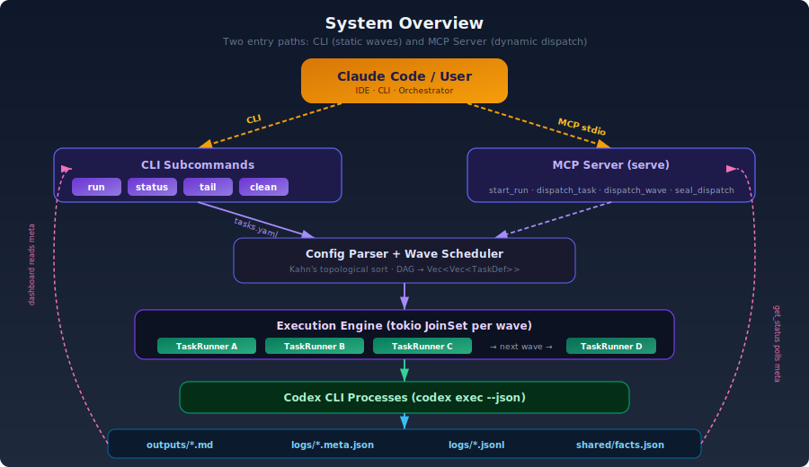
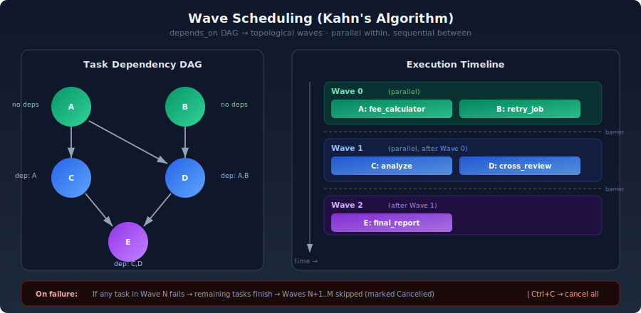
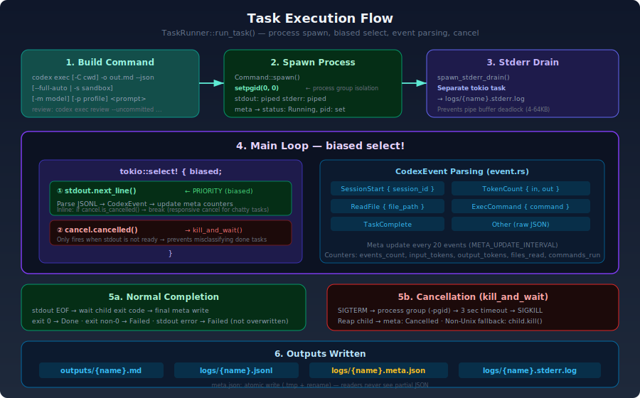
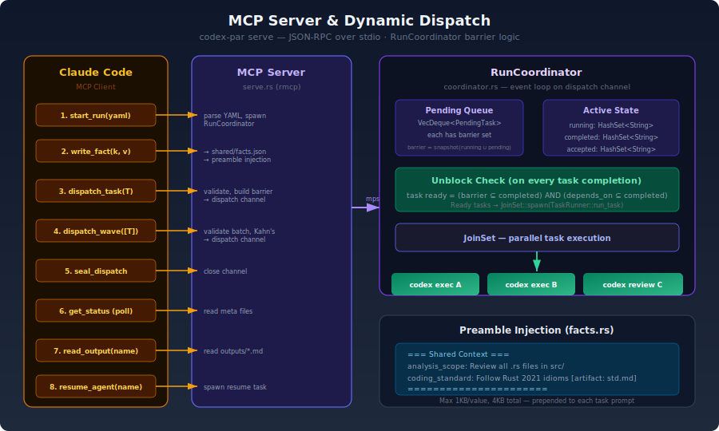
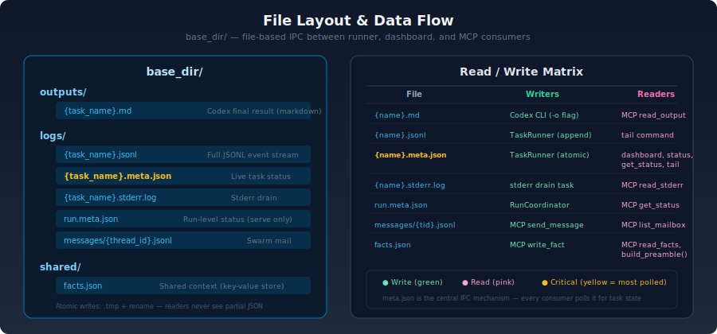

# codex-par

Run multiple [Codex](https://github.com/openai/codex) tasks in parallel, with dependency waves and a live dashboard. Also ships an MCP server so Claude can dispatch and monitor runs without blocking.

## Architecture

<p align="center">
  
</p>

## Why

When Claude calls Codex via MCP, all calls serialize — even across multiple team agents sharing one MCP server. A 3-task workload that could finish in 30 minutes takes 90 minutes. There's also a deadlock risk: Claude's MCP client is half-duplex synchronous, so if Codex tries to send a sub-request while Claude is waiting for the response, both sides hang.

`codex-par` bypasses MCP entirely. Each task spawns an independent `codex exec --json` process, achieving true process-isolated parallelism with live progress monitoring.

## Install

```bash
cargo build --release
# Binary at: target/release/codex-par

# Set CODEX_BIN if codex is not at /opt/homebrew/bin/codex (the macOS default)
export CODEX_BIN=/usr/local/bin/codex
```

## Quick Start

```yaml
# tasks.yaml
tasks:
  - name: "fee_calculator"
    cwd: "/path/to/project"
    sandbox: "read-only"
    prompt: |
      Read src/FeeCalculatorV2.java and analyze the 4-tier rate adjustment logic.
      Find precision issues and edge case defects. Output a markdown report.

  - name: "retry_job"
    cwd: "/path/to/project"
    sandbox: "read-only"
    prompt: |
      Read src/RetryJob.java and analyze the 3 failure recovery paths.
      Focus on transaction safety and data consistency risks.

  - name: "cross_review"
    depends_on:
      - "fee_calculator"
      - "retry_job"
    cwd: "/path/to/project"
    sandbox: "read-only"
    prompt: |
      Read outputs/fee_calculator.md and outputs/retry_job.md.
      Cross-review both reports. Find contradictions, systemic risks,
      and produce a prioritized fix list.
```

```bash
codex-par run tasks.yaml --dashboard
```

Wave 0 (`fee_calculator` + `retry_job`) run in parallel. Wave 1 (`cross_review`) starts only after both complete.

## Commands

```bash
# Run with live dashboard
codex-par run tasks.yaml --dashboard

# Run with custom output directory (default: current directory)
codex-par run tasks.yaml --dir /path/to/workdir

# Watch status of a running or completed run
codex-par status --dir /path/to/workdir -w 3   # refresh every 3s

# Follow a single task's event stream until it finishes
codex-par tail fee_calculator --dir /path/to/workdir

# Remove outputs/ and logs/
codex-par clean --dir /path/to/workdir

# Start as an MCP server (for Claude integration)
codex-par serve
```

All subcommands accept `--dir / -d` to set the base directory for `outputs/` and `logs/`.

## Task Configuration

| Field | Type | Required | Notes |
|-------|------|----------|-------|
| `name` | string | yes | `[A-Za-z0-9._-]` only; no spaces, slashes, or control chars |
| `prompt` | string | yes | Passed to `codex exec` as the task prompt |
| `cwd` | path | yes | Working directory for the Codex process |
| `kind` | string | no | `exec` (default) or `review` (uses `codex exec review`) |
| `sandbox` | string | no | `read-write` (default), `read-only`, `danger-full-access` |
| `model` | string | no | Override the Codex model for this task |
| `full_auto` | bool | no | Enable auto-approval; implies workspace-write sandbox (default: `true`). Incompatible with `sandbox: read-only`. |
| `config_overrides` | list | no | `key=value` pairs passed through as `-c` flags to Codex |
| `profile` | string | no | Codex profile name passed as `-p` |
| `images` | list | no | Image file paths to attach to the prompt (`-i` flag) |
| `enable_features` | list | no | Codex features to enable (`--enable` flag) |
| `disable_features` | list | no | Codex features to disable (`--disable` flag) |
| `agent_id` | string | no | Agent identity label for the task (default: task `name`) |
| `thread_id` | string | no | Thread identity label for routing (default: task `name`) |
| `depends_on` | list | no | Task names this task waits for |
| `uncommitted` | bool | no | Review uncommitted changes (`kind: review` only) |
| `base` | string | no | Review changes against this branch (`kind: review` only) |
| `commit` | string | no | Review a specific commit SHA (`kind: review` only) |
| `review_title` | string | no | Title for the review summary (`kind: review` only) |

Validation runs before any tasks start: duplicate names, unknown dependencies, cycles, and invalid characters are all rejected upfront.

## Dashboard

```
========================================================================
  CODEX PARALLEL DASHBOARD  |  19:30:45  |  3/4 done, 1 running, 0 failed
========================================================================

  -- Wave 0 (2/2 done) --
    ✓ fee_calculator
      Status: done       Duration: 12m34s   Events: 303
      Tokens: 1100K in / 15K out    Files: 45  Cmds: 12

    ✓ retry_job
      Status: done       Duration: 8m21s    Events: 187
      Tokens: 680K in / 9K out    Files: 28  Cmds: 8

  -- Wave 1 (1/2 done) --
    ⟳ cross_review
      Status: running    Duration: 5m02s    Events: 82
      Tokens: 412K in / 6K out    Files: 12  Cmds: 3
      Last: READ fee_calculator.md

    ◯ final_report
      Status: pending    Duration: -        Events: 0

------------------------------------------------------------------------
  Results: outputs/*.md  |  Logs: logs/*.jsonl  |  Ctrl+C to cancel
```

## Wave Scheduling

<p align="center">
  
</p>

Tasks are partitioned into waves using Kahn's topological sort on `depends_on`:

- Wave 0: tasks with no dependencies (all run in parallel)
- Wave 1: tasks whose dependencies are all in Wave 0 (all run in parallel)
- Wave N: tasks whose dependencies are all in waves < N

If any task in a wave fails, subsequent waves are skipped (tasks marked `cancelled`).
Ctrl+C cancels all running tasks and skips remaining waves.

## Task Execution

<p align="center">
  
</p>

Each task runs as an independent `codex exec --json` process. The runner uses a **biased `select!`** — stdout has priority over cancel to prevent misclassifying completed tasks. An inline `is_cancelled()` check between every stdout line ensures responsive cancellation even for chatty tasks.

## MCP Server (`serve`)

<p align="center">
  
</p>

`codex-par serve` exposes ten tools over stdio JSON-RPC so Claude can dispatch and extend runs without blocking:

| Tool | Description |
|------|-------------|
| `start_run` | Start a new run from inline YAML; returns immediately |
| `get_status` | Poll run and task status |
| `read_output` | Read a task's markdown output (chunked, with offset) |
| `read_stderr` | Read a task's stderr log (chunked, with offset) |
| `cancel_run` | Cancel an active run |
| `dispatch_task` | Add a single task to an active run at runtime. `depends_on` may only reference already-accepted tasks. Returns immediately. |
| `dispatch_wave` | Add a batch of tasks atomically. Intra-batch `depends_on` forward refs allowed. |
| `seal_dispatch` | Close the dispatch channel; the run finalizes when all in-flight tasks finish. Required to end a dynamic run. |
| `write_fact` | Write a shared fact (key/value) for the run. Auto-prepended to subsequently spawned worker prompts. Values larger than 1 KiB are truncated. |
| `read_facts` | Read all shared facts for a run from `shared/facts.json`. |

`start_run` returns before tasks complete. Static runs can stop there; dynamic runs stay open until `seal_dispatch`. Claude polls `get_status` and reads output once tasks are done.

### Dynamic Scheduling

Use dynamic runs in this order:

```text
start_run -> [write_fact]* -> [dispatch_task / dispatch_wave]* -> seal_dispatch -> get_status (poll) -> done
```

### MCP Configuration (Claude Desktop / claude_desktop_config.json)

```json
{
  "mcpServers": {
    "codex-par": {
      "command": "/path/to/codex-par",
      "args": ["serve"]
    }
  }
}
```

### Example Serve Task YAML

```yaml
tasks:
  - name: "review-serve"
    cwd: "/path/to/your/project"
    sandbox: "read-only"
    prompt: |
      Read docs/DESIGN.md for architecture context.
      Then review src/commands/serve.rs for correctness issues,
      focusing on race conditions, error propagation, and path safety.
      Output a markdown table: severity | issue | location | fix.
```

## Tips for Writing Prompts

**Point Codex at files explicitly.** Codex reads from `cwd`, but a prompt like `"Analyze the fee calculator"` leaves Codex to explore on its own. `"Read src/FeeCalculatorV2.java, then..."` is faster and more focused.

**Use `read-write` sandbox for find-and-fix tasks.** With `sandbox: "read-write"`, Codex can patch files directly — good for mechanical fixes. Use `read-only` when you want a review checkpoint before applying changes.

**Cross-review waves read `outputs/`.** Wave N+1 tasks can reference Wave N outputs via the `outputs/` directory. If `cwd` differs from `--dir`, use an absolute path or set `--dir` to match `cwd`.

**Embed scope constraints in the prompt.** For targeted fixes: `"Do NOT modify tests or Cargo.toml. Fix only src/commands/serve.rs."` Codex respects explicit boundaries.

## Output Files

<p align="center">
  
</p>

```
outputs/
  {task_name}.md          # Final Codex output (markdown)

logs/
  {task_name}.jsonl       # Full event stream (token counts, file reads, etc.)
  {task_name}.meta.json   # Live status: running/done/failed, timing, token counts
  {task_name}.stderr.log  # Codex stderr output
  run.meta.json           # Run-level status (serve mode only)

shared/
  facts.json              # Shared context store (serve mode only)
```

## Environment Variables

| Variable | Default | Description |
|----------|---------|-------------|
| `CODEX_BIN` | `/opt/homebrew/bin/codex` | Path to the `codex` binary |
